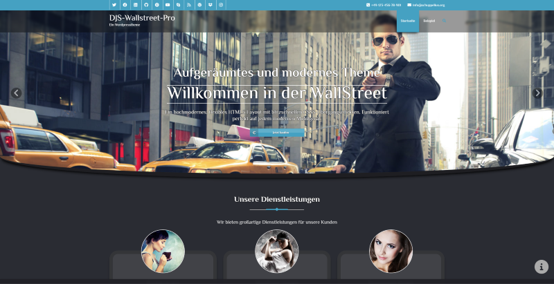

# DJS-Wallstreet-Pro

## Developer

Contributors: DSchuppelius
Version: 2.0.0
Requires at least: 5.3
Tested up to: 6.0.0
Requires PHP: 5.6.20
Requires MySQL: 5.0
License: GNU General Public License v3 or later
License URI: http://www.gnu.org/licenses/gpl.html

## Description

A Premium multi colored Business Blog theme that supports Primary menu's, Primary sidebar, Four widgets area at the footer region etc. 
It has a perfect design that's great for any Business/Firms Blogs who wants a new look for their site. Three page templates Home, Blog and Contact Page. 
Theme supports featured slider managed from Theme Option Panel.

Author: Priyanshu Mittal, Hari Maliya, Shahid Mansuri, Vibhor Purandare and Daniel Jörg Schuppelius.
Base Theme Homepage Url:http://webriti.com/demo/wp/wallstreet/
Theme Homepage Url:https://github.com/DSchuppelius/djs-wallstreet-pro/

### About

DJS-Wallstreet-Pro a theme for business, consultancy firms etc. Initial created by Webriti and continued by Daniel Jörg Schuppelius (Base Author URI: http://webriti.com) (Author URI: http://schuppelius.org). 

The CSS, XHTML and design is released under GPL:
http://www.opensource.org/licenses/gpl-license.php

Feel free to use as you please. I would be very pleased if you could keep the Auther-link in the footer. Thanks and enjoy.

Wallstreet supports Custom Menu, Widgets and the following extra features:

 - Pre-installed menu and content colors
 - Responsive
 - Custom sidebars
 - Support for post thumbnails
 - Similar posts feature
 - 4 widgetized areas in the footer
 - Customise Front Page 
 - Custom footer
 - Translation Ready 
 

### Basic Setup of the Theme.

Fresh installation!

1. Upload the DJS-Wallstreet-Pro Theme folder to your wp-content/themes folder.
2. Activate the theme from the WP Dashboard.
3. Done!

#### Images

All images in DJS-Wallstreet-Pro are licensed under the terms of the GNU GPL.

##### Top Navigation Menu:

- Default the page-links start from the left! Use the Menus function in Dashboard/Appearance to rearrange the buttons and build your own Custom-menu. DO NOT USE LONG PAGE NAMES, Maximum 14 letters/numbers incl. spaces!
- Read more here: http://codex.wordpress.org/WordPress_Menu_User_Guide

###### Page Templates

- Contact  Page Tempalte:- Create a page as you do in WordPress and select the page template with the name 'Contact'

###### Front Page Added with the theme

- It has header(logo + menus), Home Featured Image, services, recent comments widgets and footer.

###### Site Title and Description

Site Title and its description in not shown on home page besides this both are used above each page / post along with the search field.
    

## Support
-------

Do you enjoy this theme? Send your ideas - issues - on the github. Thank you!

- @version 2.0.0
    1. Refactoring Theme
    2. Add Parallaxfunctions (Background and Site-elements)
    3. Add Custom Background
    4. Add Support for Revolution Slider
    5. Add Google Fonts (Material Icons, El Messiri)
    6. Update Bootstrap 3.4.1 with Icons
    7. Update Font-awesome Library 6.1.1
    8. Add Fading Pageload
    9. Add Designobjects Frame, Filler and Big Border
    10. Add Custom Bradcrumb and Content Positions
    11. Repair Portfoliosite
    12. Split Css Files
    13. Change Links to Buttons
    14. Add fx.css for animations and others
    15. Add fixed header and footer
    16. Add attachment-site
    17. Add aktivating iframe (cookie accept)
    18. Updated german locale
    19. Add design-variants (improvement required)
    20. Add function to add and remove googlefonts
    21. Remove old logo-settings
    22. Add jetpack styles
    23. Add custom shortcodes for divs (because wp rewrites some code)
    24. Add paypal-donation button (shortcode)
    25. Add js loadscreen with option to en/disable
    26. Add diffrent content-types (post-types = aside, audio, chat, gallery, image, link, quote, status, video)
    27. Add partner section
    28. Add portfolio-style-types
- @version 1.9.9
    1. Removed duplicate and unused js.
- @version 1.9.8
    1. Updated Turkish Locale.
- @version 1.9.7
    1. Changed widget name
- @version 1.9.6
    1. Removed Duplicate Strings.
- @version 1.9.5
    1. Updated Strings.
- @version 1.9.4
    1. Added Turkish Locale
- @version 1.9.3
    1. Fixed View All Project Button Issue.
- @version 1.9.2
    1. Solved Content width.
    2. Fixed Meta issue in Page Full width template.
- @version 1.9.1
    1. Update Pot File.
    2. Update Font-awesome Library 4.7.0
- @version 1.9
    1. Added Woocommerce support.
- @version 1.8.3
    1. Added Spanish Language Translation(po and mo file).
- @version 1.8.2
    1. Change opacity effect.
- @version 1.8.1
    1. Solved Spelling Issue and Update Pot Files.
- @version 1.8
    1. Fixed page seprater issue in service, aboutus, portfolio 2,3,4 template.
    2. Fixed service icon border color issue in service template.
    3. Fixed social icon issue in our team meta box.
- @version 1.7.9
    1. Added Jetpack plugin support and Gallery overlay css.
- @version 1.7.8
    1. Update Pot Files.
- @version 1.7.7
    1. Added Spanish translated Po and Mo Files.
- @version 1.7.6
    1. Fixed feature section enable issue from layout manager.
- @version 1.7.5
    1. Removed tag from page template.
- @version 1.7.4
    1. Change blog post meta class and blog post author.
- @version 1.7.3
    1. Update Font awesome 4.6.1 to 4.6.3
    2. Add Title Tag Support
    3. Add footer-widgets, blog, portfolio, featured-images, four-columns, left-sidebar Tag.
- @version 1.7.2
    1. Archive.php Issue Resolved.
    2. Translate Contact us form Placeholder.
- @version 1.7.1
    1. Add Product Texonomy Slug Field in customizer.
- @version 1.7
    1. Add Custom Texonomy Template.
    2. Add Custom post type Slug setting.
- @version 1.6.9
    1. testimonial pouse on hover property added.
- @version 1.6.8
    1. Added WPML Support.
- @version 1.6.7
    1. Adding background image feature of both theme feature and testimonial sections.
- @version 1.6.6
    1. Layout manager problem solved in admin customizer.
- @version 1.6.5
    1. Adding custom header settings 
- @version 1.6.4
    1. Remove Default sidebar data in blog pages and archive page 
- @version 1.6.1
    1. Hide Blog Meta Setting on Page, All Pages and Archives Pages.
- @version 1.6
    1. Add Color Skin control in customizer
    2. Recommend easy Instagram Feed Plugin
- @version 1.5
    1. Remove Unused Images & file.
    2. Added Google Font.
- @version 1.4
    1. Added Customizer.
- @version 1.3
    1. Add Theme Color Scheme.
- @version 1.2
    1. Delete Extra white space in function.php file.
    2. Call footer Area in Contact-us page.
- @version 1.1
    1. Added html text box area in the footer customization settings of the option panel.
    2. All input text fields removed from the footer customization settings of the option panel.
    3. Delete Extra white space in function.php File.
    4. Add style for monster widget Image.
- @version 1.0
    released

### Imagesources

https://pixabay.com/get/427e9e99971233d123e4/1438949836/smart-watch-821557_1920.jpg?direct
