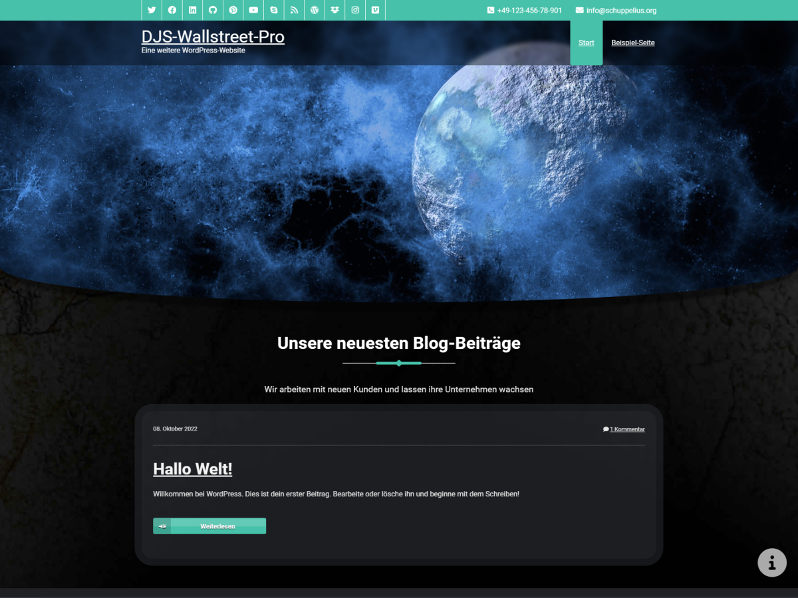

# DJS-Wallstreet-Pro

## Developer

- Contributors: DSchuppelius
- Version: 2.0.0
- Requires at least: 5.3
- Tested up to: 6.0.0
- Requires PHP: 5.6.20
- Requires MySQL: 5.0
- License: GNU General Public License v3 or later
- License URI: http://www.gnu.org/licenses/gpl.html

## Description

A Premium multi colored Business Blog theme for Wordpress that supports Primary menu's, Primary sidebar, Four widgets area at the footer region etc. 
It has a perfect design that's great for any Business/Firms Blogs who wants a new look for their site. Three page templates Home, Blog and Contact Page. 
Theme supports featured slider managed from Theme Option Panel.

- Base Theme Wallstreet-Pro
    - Homepage Url: http://webriti.com/demo/wp/wallstreet/
    - Author:
        - Priyanshu Mittal
        - Hari Maliya
        - Shahid Mansuri
        - Vibhor Purandare
- Theme DJS-Wallstreet-Pro
    - Homepage Url: https://github.com/DSchuppelius/djs-wallstreet-pro/
    - Author:
        - Daniel Jörg Schuppelius

### About

DJS-Wallstreet-Pro a theme for business, consultancy firms etc. Initial created by Webriti and continued by Daniel Jörg Schuppelius (Base Author URI: http://webriti.com) (Author URI: http://schuppelius.org). 

The CSS, XHTML and design is released under GPL:
http://www.opensource.org/licenses/gpl-license.php

Feel free to use as you please. I would be very pleased if you could keep the Auther-link in the footer. Thanks and enjoy.

Wallstreet supports Custom Menu, Widgets and the following extra features:

 - Pre-installed menu and content colors
 - Custom Background
 - Parallax-Features (Background and some Site-Elements)
 - Cookie Accept for external IFRAMEs
 - Diffrent Post-Types
    - Aside
    - Audio
    - Chat
    - Gallery
    - Image
    - Quote
    - Status
    - Video
 - Diffrent Shortcodes
    - ZDF-Mediathek [zdf url="mediathek_url"]description[/zdf] o. [zdf src="direct_src"]description[/zdf] o. [zdf media_id="mediaID"]description[/zdf]
    - DIV Shortcode for code that is otherwise manipulated by WordPress
    - PAYPAL Donationbutton
    - And so on, the old codes are still there (but some of them are buggy)
 - Responsive
 - Custom sidebars
 - Support for post thumbnails
 - Similar posts feature
 - 4 widgetized areas in the footer
 - Customise Front Page 
 - Custom footer
 - Translation Ready 
 

## Basic Setup of the Theme

Fresh installation!

1. Upload the DJS-Wallstreet-Pro Theme folder to your wp-content/themes folder.
2. Activate the theme from the WP Dashboard.
3. Done!

### Images

All images in DJS-Wallstreet-Pro are licensed under the terms of the GNU GPL.

### Top Navigation Menu

Default the page-links start from the left! Use the Menus function in Dashboard/Appearance to rearrange the buttons and build your own Custom-menu. DO NOT USE LONG PAGE NAMES, Maximum 14 letters/numbers incl. spaces!
Read more here: http://codex.wordpress.org/WordPress_Menu_User_Guide

### Page Templates

Contact Page Tempalte: Create a page as you do in WordPress and select the page template with the name 'Contact'

### Front Page Added with the theme

It has header(logo + menus), Home Featured Image, services, recent comments widgets and footer.

### Site Title and Description

Site Title and its description in not shown on home page besides this both are used above each page / post along with the search field.
    

## Support

Do you enjoy this theme? Send your ideas - issues - on the github. Thank you!

### Imagesources

https://pixabay.com/get/427e9e99971233d123e4/1438949836/smart-watch-821557_1920.jpg?direct
